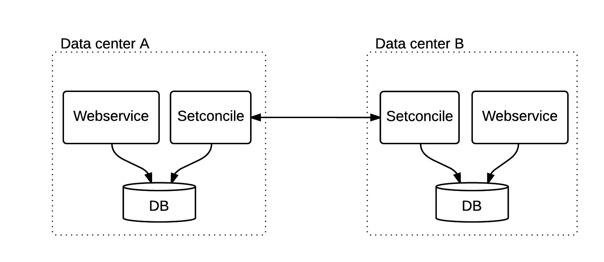

Setconcile
==========

Setconcile is a server application for keeping a pair of key-value
datasets in sync. It can for example be used in a dual data center
setup to synchronize two databases as illustrated in the figure below.

Setconcile is meant to be run at scheduled times throughout the
day. If real-time replication is needed, then additionally, the
web service itself can be made to do replicate each write as it
occurs. Setconcile is then used as a complement to correct any
real-time replications that were missed due to timeouts or data center
downtime.

The design goals for setconcile are:

 * Be efficient when the differences between datasets A and B are very
   small compared to the dataset as a whole, but also handle the case
   when a large portion of the dataset needs to be replicated.
   
 * Minimize the amount of data exchanged over the network and thus
   replication time.
 
 * Keep the algorithm and implementation simple.

Setconcile relies on application specific data resolvers being
implemented. Setconcile currently does not handle deleted objects but
assumes that the web service has some other means for pruning these.

The table below lists some sync time measurements. The following setup
was used (see [system_test](system_test/main.tf)):

 * Riak 1.4. as database.

 * One Amazon AWS m4.large instance in Ireland (site A) and one in
   Virginia (site B).

 * A dataset consisting of 1 million 1 KB objects.

The times in the table below exclude the initial one time (per sync)
mapreduce time of a few minutes.

Percent of dataset that differs  | Best sync time (excluding mapreduce time)
-------------------------------- | -----------------------------------------
0.1%                             |  ~50 s
10%                              |  6.5 min

References
----------
[1] T. Maseng, M. Skjegstad. Low Complexity Set Reconciliation Using Bloom Filters. In FOMC '11 Proceedings of the 7th ACM ACM SIGACT/SIGMOBILE International Workshop on Foundations of Mobile Computing, 2011.

Copyright (c) 2015 Ulf Leopold.
